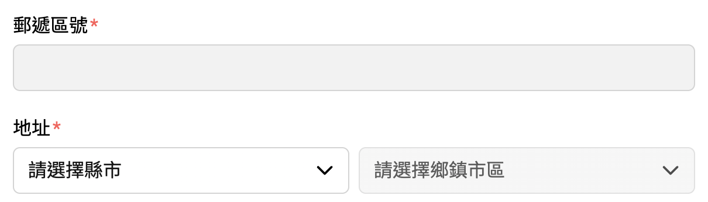

# Twzipcode Webcomponent

Webcomponent 版本 Twzipcode，不含 Shadow DOM，可以直接套 style


## 使用方式

```zsh
npm i twzipcode-webcomponent
```

```js
import 'twzipcode-webcomponent'
```

```html
<!-- 自動生成元件 -->
<twzipcode-fieldset></twzipcode-fieldset>

<!-- 可以添加 label 等元件 -->
<twzipcode-fieldset>
	<div>
		<label>郵遞區號</label>
		<zipcode-field></zipcode-field>
	</div>
	<div>
		<label>縣市</label>
		<county-field></county-field>
	</div>
	<div>
		<label>鄉鎮市區</label>
		<district-field></district-field>
	</div>
</twzipcode-fieldset>
```

## 選項

```html
<twzipcode-fieldset
	lang="zh-tw 或 en。預設 zh-tw，沒有動態切換語系的功能"
	<!-- 注意臺北（✓）、台北（✗） -->
	:default-values="JSON.stringify({
		zipcode: '三個 key',
		county: '都有值',
		district: '才會生效',
	})"
	<!-- 忽略選項：縣市或是特定縣市下的鄉鎮市區，這兩項給中文就好，en 下會自動轉換 -->
	:ignore-counties="JSON.stringify(['澎湖縣', '金門縣', '連江縣'])"
	:ignore-districts="JSON.stringify({ 宜蘭縣: ['釣魚臺列嶼'], 屏東縣: ['琉球鄉'], 臺東縣: ['綠島鄉', '蘭嶼鄉'] })"
>
	<zipcode-field
		classes="給 zipcode input 的 class"
		name="input 的 name"
		placeholder="預設空字串"
	></zipcode-field>
	<county-field
		classes="給 county select 的 class"
		name="select 的 name"
		placeholder="select 第一個選項，預設 ---"
	></county-field>
	<district-field
		classes="給 district select 的 class"
		name="select 的 name"
		placeholder="select 第一個選項，預設 ---"
	></district-field>
</twzipcode-fieldset>

```

### 純 JS 做法

```js
const $twzipcode = document.querySelector('twzipcode-fieldset')
// 注意臺北（✓）、台北（✗）
$twzipcode.setAttribute('ignore-counties', JSON.stringify(['澎湖縣', '金門縣', '連江縣']))
$twzipcode.setAttribute('ignore-districts', JSON.stringify({ 宜蘭縣: ['釣魚臺列嶼'], 屏東縣: ['琉球鄉'], 臺東縣: ['綠島鄉', '蘭嶼鄉'] }))
```

## 事件

```js
const $twzipcode = document.querySelector('twzipcode-fieldset')
// 縣市與鄉鎮市區選擇後，zipcode 更新完才會觸發
$twzipcode.addEventListener('done', e => {
	// { zipcode: '100', county: '臺北市', district: '中正區' }
	console.log(e.detail.value)
})
```

## 備註

[src/data](src/data) 裡的資料是根據 `twzipcode-data` 用 `format-twzipcode-data.js` 重新整理而成，執行 `bun run migrate` 即可
